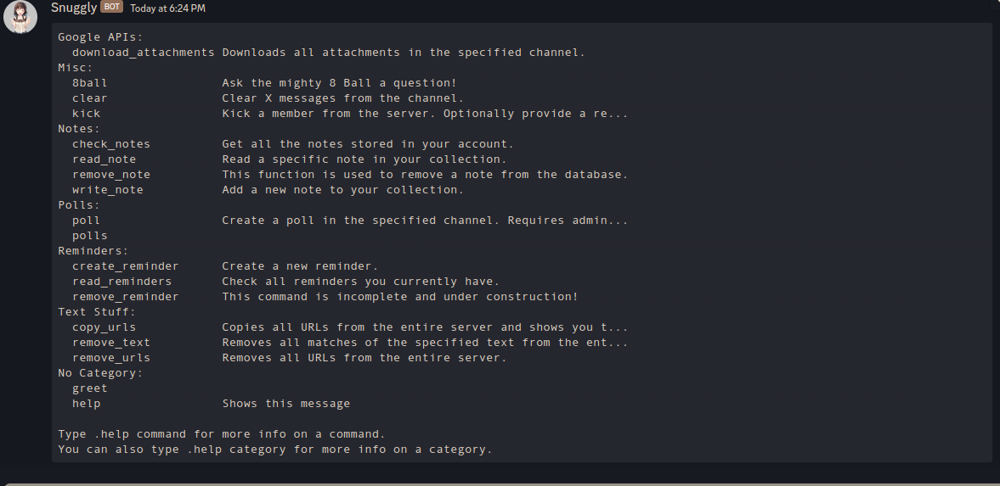

# Snuggly - Discord Bot
Snuggly is a discord bot I created with discord.py. To add this bot to your own server, please click [HERE](https://discord.com/api/oauth2/authorize?client_id=832217886880825364&permissions=0&scope=bot) to invite it.

## Command Prefix
The command prefix is a period/dot. ( . )

## Features
- Note taking
- Polls
- 8ball
- Reminders
- Server administration (kicks, bans, etc.)
- Bulk copy/remove stuff (I have no idea what else to call it...)

Just run the help command ( .help ) to get more information on any of these.

## Why
I mainly built this bot as a practice project to learn discord.py. I may add more weird features in the future, just for learning purposes. 

## About me
I'm a freelance developer. Wanna see more of my work? See my website here: https://www.hassandev.me
